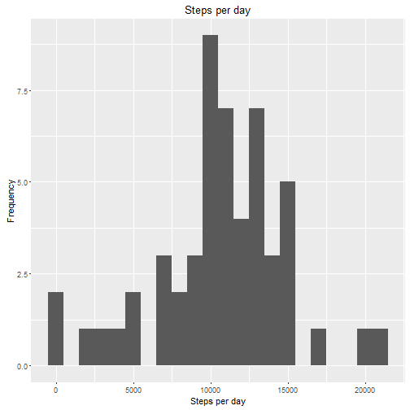
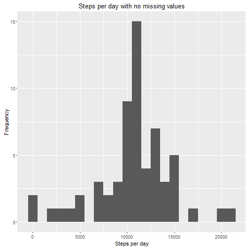
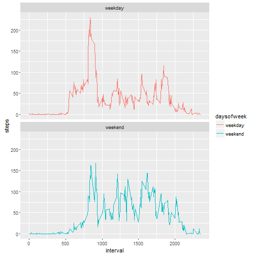

```r
library(dplyr)
library(lubridate)
library(ggplot2)

## Load the data
activity <- read.csv("data/activity.csv", header = TRUE, sep = ',', colClasses = c("numeric", "character", "integer"))

head(activity)
```

```
##   steps       date interval
## 1    NA 2012-10-01        0
## 2    NA 2012-10-01        5
## 3    NA 2012-10-01       10
## 4    NA 2012-10-01       15
## 5    NA 2012-10-01       20
## 6    NA 2012-10-01       25
```

```r
## What is mean total number of steps taken per day?
### 1. Calculate the total number of steps taken per day

steps <- activity %>%
        filter(!is.na(steps)) %>%
        group_by(date) %>%
        summarize(steps = sum(steps))

### 2. Plot a histogram of total number of stpes taken per day
ggplot(steps, aes(x = steps)) +
        geom_histogram(binwidth = 1000) +
        labs(title = "Steps per day", x = "Steps per day", y = "Frequency")
```



```r
### 3. Calculate and report the mean and meidan of the total number of steps taken per day
meanSteps <- mean(steps$steps, na.rm=TRUE)
medianSteps <- median(steps$steps, na.rm=TRUE)

meanSteps
```

```
## [1] 10766.19
```

```r
medianSteps
```

```
## [1] 10765
```

```r
## What is the average daily activity pattern?
### 1. Make a time series plot (i.e. type = "l") of the 5-minute interval (x-axis) and the average number of steps taken, averaged across all days (y-axis)

interval <- activity %>%
        filter(!is.na(steps)) %>%
        group_by(interval) %>%
        summarize(steps = mean(steps))

ggplot(interval, aes(x=interval, y=steps)) +
        geom_line()
```


```r
### 2. Which 5-minute interval, on average across all the days in the dataset, contains the maximum number of steps?
maxStep <- interval[which.max(interval$steps),]
maxStep
```

```
## Source: local data frame [1 x 2]
## 
##   interval    steps
##      (int)    (dbl)
## 1      835 206.1698
```

```r
## Imputing missing values
### 1. Calculate and report the total number of missing values in the dataset (i.e. the total number of rows with NAs)

missingValues <- sum(is.na(activity$steps))
missingValues
```

```
## [1] 2304
```

```r
### 2. Devise a strategy for filling in all of the missing values in the dataset. The strategy does not need to be sophisticated. For example, you could use the mean/median for that day, or the mean for that 5-minute interval, etc.
### 3. Create a new dataset that is equal to the original dataset but with the missing data filled in.
fullActivity <- activity
na <- is.na(fullActivity$steps)
avgInterval <- tapply(fullActivity$steps, fullActivity$interval, mean, na.rm=TRUE, simplify=TRUE)
fullActivity$steps[na] <- avgInterval[as.character(fullActivity$interval[na])]

### 4. Make a histogram of the total number of steps taken each day and Calculate and report the mean and median total number of steps taken per day. 

stepsFull <- fullActivity %>%
        filter(!is.na(steps)) %>%
        group_by(date) %>%
        summarize(steps = sum(steps))

ggplot(stepsFull, aes(x = steps)) +
        geom_histogram(binwidth = 1000) +
        labs(title = "Steps per day with no missing values", x = "Steps per day", y = "Frequency")
```



```r
####  Calculate the mean and median
meanStepsFull <- mean(stepsFull$steps, na.rm = TRUE)
medianStepsFull <- median(stepsFull$steps, na.rm = TRUE)

meanStepsFull
```

```
## [1] 10766.19
```

```r
medianStepsFull
```

```
## [1] 10766.19
```

```r
#### Do these values differ from the estimates from the first part of the assignment? 
##### The value of median is different

#### What is the impact of imputing missing data on the estimates of the total daily number of steps?
##### The mean and median value is same


## Are there differences in activity patterns between weekdays and weekends?
### 1. Create a new factor variable in the dataset with two levels ¡V ¡§weekday¡¨ and ¡§weekend¡¨ indicating whether a given date is a weekday or weekend day.
fullActivity$date <- ymd(fullActivity$date)

fullActivity <- mutate(fullActivity, daysofweek = ifelse(weekdays(fullActivity$date) == "Saturday" | weekdays(fullActivity$date) == "Sunday", "weekend", "weekday"))
fullActivity $daysofweek<- as.factor(fullActivity$daysofweek)

### 2. Make a panel plot containing a time series plot (i.e. type = "l") of the 5-minute interval (x-axis) and the average number of steps taken, averaged across all weekday days or weekend days (y-axis). 
intervalFull <- fullActivity %>%
        group_by(interval, daysofweek) %>%
        summarise(steps = mean(steps))
ggplot(intervalFull, aes(x=interval, y=steps, color = daysofweek)) +
        geom_line() +
        facet_wrap(~daysofweek, ncol = 1, nrow=2)
```



